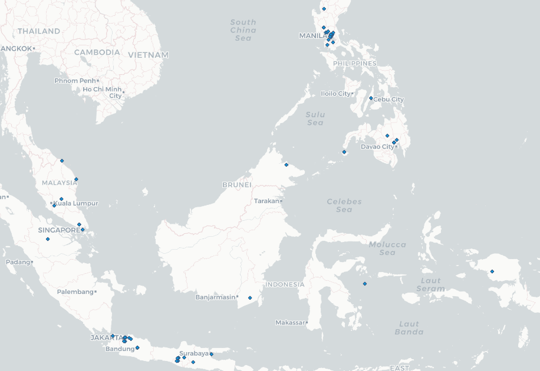

# GEOG 458 Lab 2
The map below visualizes Tweets made in the Philippines, Malaysia and Indonesia. The reason I wanted to highlight these three Southeast Asian areas is to mainly focus on the Philippines. In mind, the Philippines has a very strict media control that is initiated from the Government. I wanted to also look at Malaysia and Indonesia to see if there were similar patterns, considering the proximity of the countries.

As you can see from the map above, majoity of the Tweets coming from the Philippines are cultered in the countries capiols: Manila and Cebu. The rest of the country doesn't seem to be producing much activity. Unlike the observed surrounding countries (Indonesia and Malaysia) have more scattered data of Tweets being made.

Social dictatorship in the Philippines is something that has been going on for a long time. It's upsetting to see citizen being influenced by news filtered by thier own government. People themselves have to be cautious about what they post and how it can be interpreted, especially in a political point of view. 
